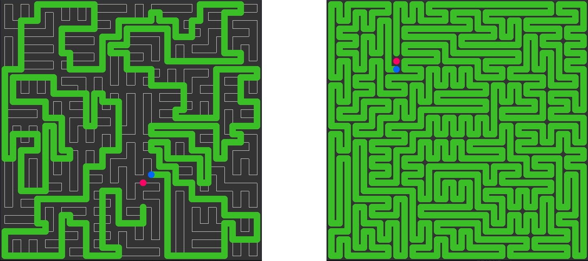

## CNAKE++AI: a snake ai in c++ 

****

### Build

- **Dep**: apt-get update && apt-get install g++ cmake libsfml-dev  
- **Run**: cb bin && ./build -R && ./compile && ./run  

```
usage: app/exec [-h] [-M MODE] [-S SIZE]

CNAKE++AI

optional args:
  -h        show this help message and exit
  -M MODE   set mode  < phc | hc | play >
  -S SIZE   set size  < small | large >

optional cmds:
  key SPACE set frate 24FPS, VSYNC, MAX
  key D     set debug NO, YES
```

****

### Demo

  

  
